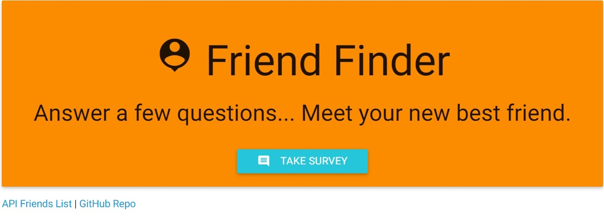
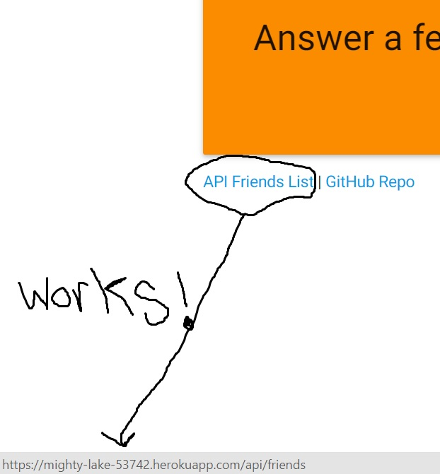

# FriendFinder
Welcome to my FriendFinder app! This homework assignment was due during Week 8 at UC Berkeley Coding Boot Camp. Simply answer a few questions and you are matched with a new BFF from the database of friends who have used this app already. You could be matched with an heroic Iraqi militia leader, a Vietnamese pop star or even the guitarist from legendary band KISS! Or just me. Or Sixto Lezcano. The matches are based on your input scores in response to 10 carefully procured personality questions that are to be taken entirely seriously.

## Getting Started
https://mighty-lake-53742.herokuapp.com/

## Screen Shots

Home


Survey


Your New BFF!


Friends List


Working Friends Link


## Technologies used
- Node.js
- body-parser NPM Package - https://www.npmjs.com/package/body-parser
- express NPM Package - https://www.npmjs.com/package/express
- path NPM Package - https://www.npmjs.com/package/path

### Prerequisites

```
- Node.js - Download the latest version of Node https://nodejs.org/en/
- Materialize - Add CDN link to HTML http://materializecss.com/getting-started.html
```

## Built With

* Sublime Text - Text Editor
* Materialize - Wireframe

## Authors

* **Mike Thompson** - *HTML/JS/Node.js* - [Mike Thompson](https://github.com/mict2000)
